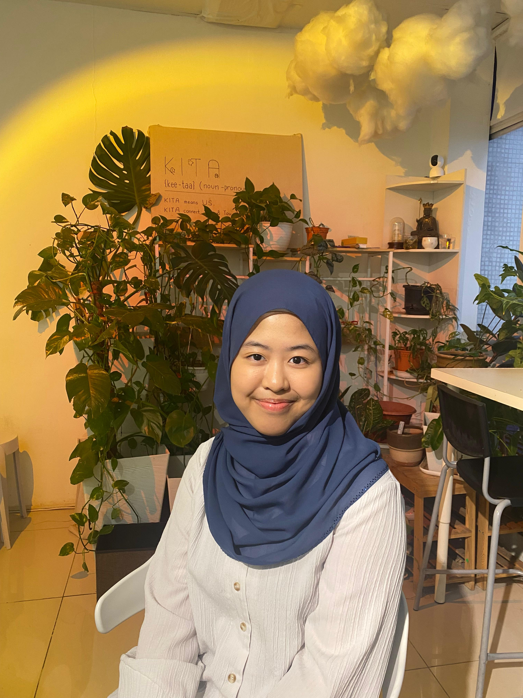

# Welcome to Sunsine! :high_brightness:

We are Sunsine, a Github group of 2 - Aribah & Syazwani. 
Just like the sine wave, we believe in the rise and flow of ideas. At Sunsine,
we bring energy and light into coding, creating innovations and sparking solutions to solve problems. 
Our goal is to shine bright and excel, living up to the promise of our name.

Get to know us:

|Member|:sun_with_face:|
|----|----|
|Aribah|[Aribah's profile](https://github.com/sm2302-aug24/labs-grp-sunsine/tree/AribahAzhan.md#)|
|Syazwani|[Syazwani's profile](https://github.com/sm2302-aug24/labs-grp-sunsine/tree/nrwanikmli.md#)|

| **Group** | sunsine :sunny: |
|-----|:----:|
| **Name** | Aribah Farzana @Balqis Binti Aiddy Azhan |
| **Student ID** | 21B2023 |
| **Favourite Math Concept** | Double-angle indentities :triangular_ruler: |
| **Hobby** | baking and watching kdramas |
| **Favourite Colour** | pink |
| **Favourite place** | cafes :coffee: :cake: |

| **Group** | sunsine :sunny: |
|-----|:----:|
| **Name** | Nur Syazwani binti Kamal Ali|
| **Student ID** | 21b2015 |
| **Favourite Math Concept** | Differentiation |
| **Hobby** | Keychain Collection |
| **Favourite Colour** | Green :green_heart: |
| **Favourite place** | Places with a lot of foods! :pizza: :rice: :icecream: |

